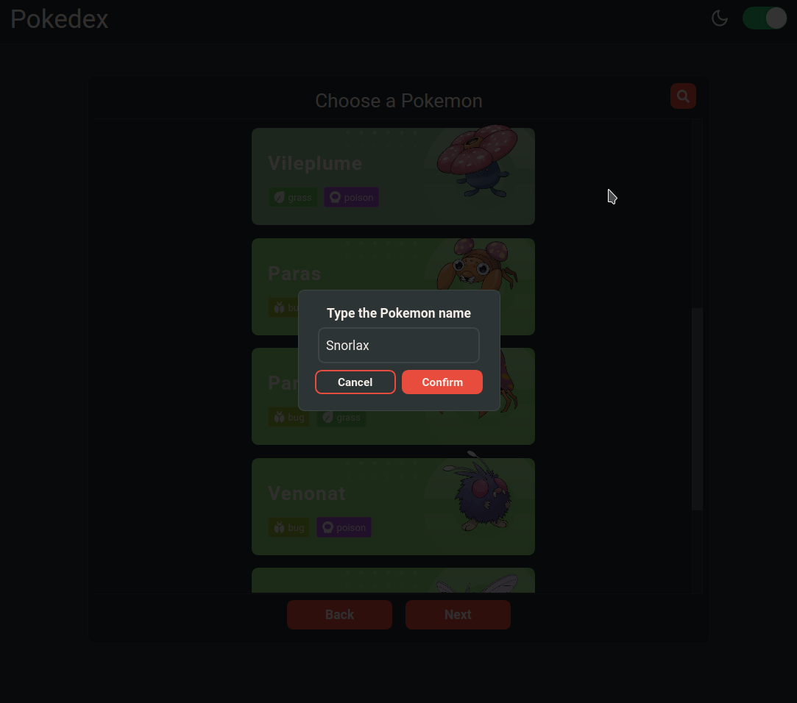

# Wiser Job Test [POKEDEX]

This project was bootstrapped with [Create React App](https://github.com/facebook/create-react-app).

## Details

This is a little application that consumes an api of pokemons "pokeapi".

## Tools

- 
- <b>:atom_symbol: -- React-JS</b>
- <b>:nail_care: -- Styled Components</b>

## Implementations

- <b>:high_brightness: -- React-Redux</b>
- <b>:white_check_mark: -- Tests</b>
- <b>:iphone: -- Responsivity</b>
- <b>:tada: -- Deployment</b>
- <b>:envelope_with_arrow: -- Api Consuming</b>
- <b>:anchor: -- Hooks</b>

## Usage

:rocket: You can visit the deployed version <a href="https://wiser-test-front-end-pokedex.vercel.app" rel="">Vercel Deployment</a>.

:octocat: Or just clone this repo and...

(1) Run $ yarn to install all the dependencies

(2) Run $ yarn start to executes the application

(3) You can consume a different api just changing the REACT_APP_API_KEY=

## Preview

